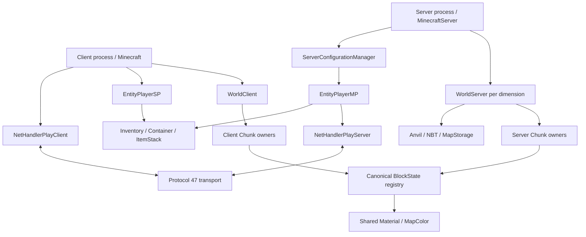

# Minecraft Java 1.8.9 / MCP919 互換実装仕様

版: 0.1、2026-10-03。対象: 提供された MCP919 の Java 1.8.9、通信 protocol 47。
状態: **仕様策定中。本文だけで全 Minecraft を再実装できる完成仕様にはまだ達していない。**

本書は現在の C919 の機能一覧ではなく、原版を独立した C/C++ 実装へ翻訳するための規範を定める。目標は「原版ソースを読まず、この Markdown 文書群だけを読んで、同じ入力に同じ結果を返すクライアントとサーバーを作れること」。その判定を概要の充実度や既存 C のテスト数で代用しない。

## 1. 文書の構成と読み方

| 文書 | 実装者が取り出す契約 |
|---|---|
| [実行モデル](01-runtime.md) | Java の数値・参照・配列・例外、初期化、乱数、クライアント／サーバーの時計と処理順 |
| [ワールドと保存](02-world-storage.md) | NBT、Anvil、座標、Chunk、照明、時間、ワールド生成と未充足の範囲 |
| [通信](03-network.md) | 接続状態、protocol 47 の全登録、各 packet の wire schema、圧縮・暗号化・login |
| [ゲーム処理](04-gameplay.md) | registry、アイテム、インベントリ、Container、クラフト、Entity、ゲーム挙動 |
| [MaterialとBlockState](07-material-block-state.md) | 全Material/MapColor静的データ、field、property equality、canonical state graphとBlock constructor順 |
| [クライアントとリソース](05-client-resources.md) | 起動、入力、GUI、リソース優先順、モデル、描画・音の観測対象 |
| [適合性と検証](06-conformance.md) | メソッド契約、観測形式、差分、統合試験、仕様／実装の完了条件 |
| [充足表](coverage.md) | 調査母数、分野別の不足、機械可読の判定データ |

各章の「確定」は、その節に書いた条件と範囲について原版を調査したという意味である。章全体、すべての依存ライブラリ、全入力での実装適合を保証する語ではない。実装の現在地は既存の [compatibility.md](../compatibility.md) と [porting.md](../porting.md) に分離する。既存 native 動作を原版の規範へ昇格させない。

原版のクラス名・フィールド名は説明の識別子であり、原本ソース、マッピング、Java 本文の転載は本書に含めない。根拠クラスの記載は監査用であり、実装手順の「残りはそのクラスを読む」という代用品にはならない。根拠を読まなければ決まらない挙動は充足表の不足として残す。

## 2. 固定する対象

| 項目 | 規範 |
|---|---|
| ゲーム版 | Minecraft Java 1.8.9。後の版の修正・registry・戦闘・チャンク形式を混ぜない |
| 提供ソース | MCP919 の client ソース木。server クラスも同じ木に存在する |
| 元バイナリ | 提供された 1.8.9 JAR、SHA-256 `14f0d96d1a56fb4f5c3b2233d00699525893fe5ce3dcf181e7de59120595d298` |
| ソース集合の識別 | 1613 Java ファイル、合計10283211 bytes。UTF-8相対パスのbyte順（大文字小文字を区別）でパスと各ファイル SHA-256 を束ねた fingerprint は `f4abe0ce50fcbcbd0659af7724fad093873259963f6bbf7361019f72e0534104` |
| Java の基準 | Java 8 の型・評価・例外契約と、対象 JAR が実際に依存するライブラリ版 |
| ゲーム側の周期 | サーバーの50 ms周期、クライアント Timer の20 ticks/s。フレーム周期とは区別 |
| 実装言語 | Cを基本に、C++・外部ライブラリを必要な境界で利用可 |
| 実装配置 | `src/minecraft/net/minecraft/` の原版責務に対応する構造。native 環境接続は識別できる名前へ分離 |
| 公開 | harnakam の Public repository。原本 Java、MCP一式、mapping、JAR、Minecraft資産、save、私的観測資料を含めない |

調査母数は AST の named type 2067、匿名 body 344、field declarator 7446、method declaration 15232、constructor declaration 2006。これは実バイナリの synthetic bridge／accessor／暗黙 constructor の総数ではない。宣言を数えたことと意味を仕様化したことは別である。

対象ソース木の `Start` は開発ランチャーであり、実ゲームの起動契約は `client.main.Main`／サーバー起動経路に分ける。Realms、配信、統計、コマンドなども母数に含む。利用できない外部サービスを理由に暗黙に仕様対象から除外しない。

## 3. 互換性の意味

互換性は次の観測が一致することを要求する。

1. **構造:** クラス関係、フィールドの型と所有者、初期値、static と instance の区別、オブジェクトの identity と alias。
2. **処理:** 正常値だけでなく、分岐、仮想呼び出し、再評価、乱数消費、失敗までに済んだ mutation と外部効果。
3. **時間:** tick順序、scheduled task、部分tick、サーバーとクライアントの責務、同期と待機。
4. **通信:** 全packetの状態・方向・ID・フィールド、codec状態切替、handlerによる実状態変更、認証・暗号化。
5. **永続化:** NBT型、ID、タグ、省略値、Anvil、session lock、更新・再読み込み後の意味。
6. **プレイ:** 全Block／Item／Entity／TileEntity／recipe／command等の相互作用。
7. **表示と操作:** 同じユーザー資産と入力によるGUI、モデル、カメラ、描画、音、テキスト、ゲーム画面遷移。
8. **障害:** 例外の種類・発生点・catch/finally・切断・復旧。native都合の停止をJava例外互換と呼ばない。

機能が表示できること、protocol47を話すこと、offlineのCreativeで入れること、フォルダーが原版に似ていることは、それぞれ限られた条件であり、全体の完了条件にはならない。

## 4. 原版から契約へ変換する規則

### 4.1 クラスの契約

すべての named／anonymous／enum class に、親、interface、instance field、static field、default value、initializer、constructor、override、traceされる参照を記載する。Cでは最派生オブジェクトの中に親の状態が一つだけ存在する。親と子に位置やinventoryやworldを複製しない。

原版の identity 比較を、IDの一致や構造比較へ置換しない。同じ色を持つ二つのMaterialは別の物体であり、同じMaterialから返るMapColorは同じ参照である。state graph／registry／cacheも、その用途のidentityとequalsを個別に定義する。

### 4.2 メソッドの契約

各メソッド・constructor・initializerは、入力、入場条件、順序付き処理、出力、変更先、依存呼び出し、例外、観測列、検証ケースを持つ。条件式中の仮想getterを一度だけ取得して共通化する変更は、その元の再評価を証明しない限り認めない。

失敗は「ロールバック」と決めつけない。原版が失敗前にfield、乱数、registry、他receiver、packet queueを更新したなら、それが残る。native側の安全なgraph commitと、元のゲーム処理の例外prefixは別の契約である。

### 4.3 データ・定数の契約

登録表には、数値ID、名前、登録順、実クラス、constructor引数、default state、metadata変換、property列、音、hardness、light、color、creative groupを必要な粒度で載せる。数値IDと名称だけの表は登録仕様の一部である。model／textureのファイル名だけでは描画仕様にならない。

recipeは入力位置、個数、damage wildcard、NBT扱い、出力、残余Item、照合順、呼出し時に返すコピー／aliasを載せる。既存Cの静的365件だけで特殊recipeを含む原版全体と数えない。

### 4.4 版違い・既知の癖

後のMinecraftの挙動や一般的に自然な処理を持ち込まない。空のCartesian成分を含む最初の`hasNext`が終了状態へ変更しながらtrueを返す分岐など、提供ソースと実classfileが一致する癖も仕様対象になる。疑わしいdecompile結果は実classfileで確認し、まだ実行していないstatic推論を実行差分の証拠と混ぜない。

`ResourceLocation`の一文字domain、floatの丸め、shortの折返し、Creative満杯時の消費、古いShiftクラフトなどを「改善」の名前で修正しない。修正版を別profileとして実装する場合も、この互換profileの観測は維持する。

## 5. 主要な所有者と境界

図の共有ノードは責務の共通種類を示し、別processのclientとserverが同じメモリを共有する意味ではない。process内でworld参照、親子receiver、registry、staticsのaliasを維持する。dimension移動、disconnect、respawn、save/reload時のidentity更新は個別に契約化する。

| native境界 | 許される担当 | 原版仕様へ混ぜてはいけないもの |
|---|---|---|
| メモリ | allocation、root、trace、clone、lifetime、安全なC表現 | 新しい原版field、黙ったalias複製、全失敗の同一分類 |
| OS | clock、thread、socket、file、window、input | 毎frameと毎tickの混同、独自世界サイズの固定 |
| codec | big endian、VarInt、zlib、暗号、NBT | packetの独自ID、未知field消去、黙った値のclamp |
| ライブラリ | JDK/Guava/Gson/Netty/LWJGL/Authlib契約の実現 | 異なるcollection順、modern版のschema、認証迂回 |
| durable store | 実際の保存I/O、環境側の保護 | C919独自形式をAnvilと呼ぶこと |
| renderer | OpenGL相当の状態・geometry・texture出力 | 全Blockを単色cube扱いして完成と呼ぶこと |

## 6. 実装単位の依存順

実装は仕様記述の完了から切り離す。仕様を先に読む工程では、runtime→collections→registry/property/state→world/chunk→entity/inventory→server/network effects→client/renderという依存順を利用する。networkのwire契約とNBTのbinary契約は並行して確定できる。

現在のCのnative scalar tableや独自dense保存は、SourceBlock／SourceChunkへ移行するまで環境接続として記録する。移行時にSourceとnativeの二つのauthoritative ownerを残さない。propertyのcanonical state graphを、整数paletteの外観だけで代用しない。

## 7. 本書の完成条件

すべての条件を満たすまで仕様の`complete`はfalseである。

- 対象ソース／実classfile／依存版の集合を固定し、匿名class、static、synthetic到達経路も対象に入れる。
- 全class／field／constructor／method／initializerに一意な契約IDを割り当て、章・節・検証条件へ結びつける。
- 各契約に全分岐、呼出順、alias、数式、入出力と失敗prefixを記述する。
- codec、registry、recipe、NBT、全gameplay dataの表が、外部ソースを読み足さず実装できる。
- 全外部依存の必要な意味を本文か同梱仕様へ閉じる。単にAPI名を列挙して済ませない。
- 未調査・仕様欠落・矛盾・未確定が0。除外を増やして数値を0にしない。
- 独立レビューが、本書だけを使って代表的な別実装を再構成し、原版観測と照合できる。

現時点は複数分野の具体的契約を記述した最初の版であり、全メソッド個別契約や全地形／Mob／描画を閉じていない。[充足表](coverage.md)と監査の厳格モードが、この不足を検出する。残りを概要や「原版と同じ」で埋めて完成扱いしない。

## 8. 仕様の改訂

新しい事実は対象版・根拠・観測条件を伴って追記する。誤った契約を修正するときは、仕様差分と影響する契約IDを記録する。原版の既知の不整合を修正するprofileは、このprofileと分けて記述する。

各公開更新前に、リンク、機械可読充足表、定数・登録数、未充足状態、Git allowlistを検証する。Markdownのみを変えた版では、前のCビルド結果を新しい実装検証のように言わない。
